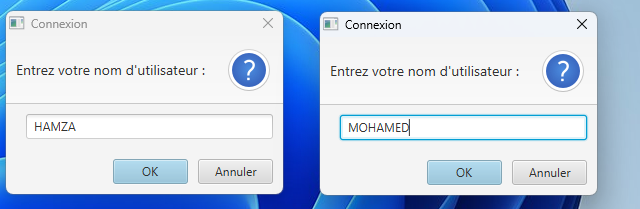
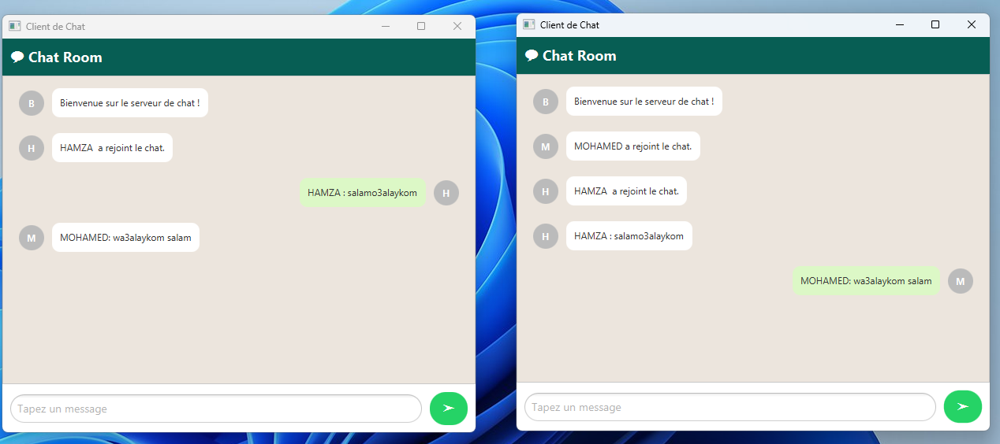

# 💬 Chat Room

Un projet Java basé sur les Sockets, multithreading et JavaFX 
permettant à plusieurs utilisateurs de discuter en temps réel via une interface graphique simple. 
Le système est basé sur une architecture client-serveur multithread.

---
## 📸 Aperçu de l'application



## 🧠 Fonctionnalités

- Interface graphique utilisateur construite avec JavaFX.
- Connexion multi-utilisateurs en local via socket TCP.
- Interface intuitive avec avatars dynamiques.
- Messages affichés avec styles distincts pour l'expéditeur et les autres utilisateurs.
- Scroll automatique vers le dernier message.
- Détection de déconnexion simple avec le mot-clé `bye`.

---

 ## 🧱 Structure du projet

```bash
├── src/
│   ├── ChatClient1.java            # Point d'entrée JavaFX
│   ├── ChatClientController.java   # Logique de l'interface utilisateur
│   ├── ServerMultithread.java      # Serveur principal TCP
│   └── SocketThread.java           # Thread pour gérer chaque client connecté
├── resources/
│   └── chat_client.fxml            # Vue JavaFX (FXML)
└── README.md
```

## 🛠️ Prérequis
Java JDK 11+

JavaFX SDK installé et correctement configuré

Un IDE (comme IntelliJ, Eclipse, VS Code avec extensions Java)


## 📦 Technologies utilisées

Java 

JavaFX (FXML pour l'interface utilisateur)

Sockets TCP (pour la communication réseau)

Threads (pour la gestion concurrente des clients côté serveur)

---
